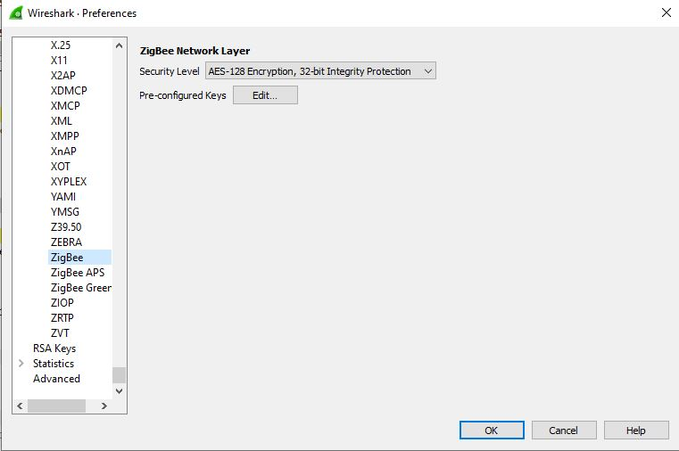
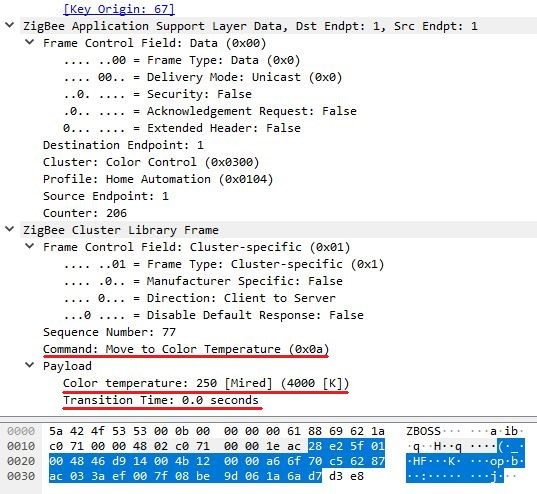

> # Zigbee2MQTT

## Inleiding

We maken gebruik van [zigbee2mqtt](https://www.zigbee2mqtt.io) om enkele security issues van Zigbee (en MQTT) te onderzoeken. Als Zigbee adapter maken we gebruik van een CC2531 USB sniffer. Deze is niet bijzonder krachtig (Small network (< 20 devices)) maar voldoet voor ons onderzoek.


Installatie van Zigbee2MQTT en een MQTT broker - in ons geval Mosquitto - gebeurt op een RaspBerry Pi. 

## Flashen van de CC2532 USB sniffer

Voor we gebruik kunnen maken van de CC2531 is het nodig om deze te voorzien van de goede firmware. Instructies hiervoor vonden we op deze [pagina](https://www.zigbee2mqtt.io/information/flashing_the_cc2531.html).

## Installatie van Mosquitto 

Voor we Zigbee2MQTT installeren installeerden we een MQTT broker op de Raspberry Pi. Kort en bondig de stappen die we hiervoor gebruikten.

Installatie

```{bash}
sudo apt install mosquitto mosquitto-clients
```

Service activeren en automatisch laten starten bij reboot.

```{bash}
sudo systemctl enable mosquitto
```

Status van de service checken kan met volgend commando

```{bash}
sudo systemctl status mosquitto
```

En dit genereert de volgende output...

```{}
    ● mosquitto.service - Mosquitto MQTT v3.1/v3.1.1 Broker
   Loaded: loaded (/lib/systemd/system/mosquitto.service; enabled; vendor preset: enabled)
   Active: active (running) since Fri 2020-11-27 20:52:16 CET; 2 weeks 1 days ago
     Docs: man:mosquitto.conf(5)
           man:mosquitto(8)
 Main PID: 462 (mosquitto)
    Tasks: 1 (limit: 4915)
   CGroup: /system.slice/mosquitto.service
           └─462 /usr/sbin/mosquitto -c /etc/mosquitto/mosquitto.conf

nov 27 20:52:15 raspberrypi systemd[1]: Starting Mosquitto MQTT v3.1/v3.1.1 Broker...
nov 27 20:52:16 raspberrypi systemd[1]: Started Mosquitto MQTT v3.1/v3.1.1 Broker.
```

## Installatie van Zigbee2MQTT

Hierna hebben we Zigbee2MQTT geïnstalleerd volgens de instructies op deze [pagina](https://www.zigbee2mqtt.io/getting_started/running_zigbee2mqtt.html).

Een belangrijke stap die we zeker willen vermelden hierbij is om een nieuwe netwerk-key aan te maken bij de volgende heropstart. Dit in plaats van de default netwerk-key wat een veiligheidsrisico kan zijn. Dit kan door toevoeging van volgende lijnen aan `configuration.yaml`.

```{}
advanced:
    network_key: GENERATE
```

Na heropstart is de webinterface beschikbaar op poort 8080.


In deze webinterface is het mogelijk om in te stellen of het mogelijk is om nieuwe Zigbee apparaten met het netwerk te laten verbinden (disable/permit join(all)). Dit kan ook ingesteld worden in de `configuration.yaml` d.m.v.

```{}
permit_join: true
```
Hierna is het mogelijk nieuwe apparaten te laten pairen met het Zigbee netwerk. Hoe we dit doen is specifiek voor elk apparaat. Meestal is er hiervoor een knop aanwezig. Na het pairen stelt het apparaat zich voor aan de Zigbee router en wordt de netwerk-key uitgewisseld.

Aangezien elk apparaat kan pairen met de router d.m.v. een Master Key is het nodig om wanneer alle apparaten binnen het netwerk zijn geconfigureerd in te stellen dat het niet toegelaten is nieuwe nodes toe te voegen aan het Zigbee netwerk. Dit kan eenvoudig door
```{}
permit_join: false
```
in te stellen. Dit is een zeer belangrijke veiligheidsissue.

Na het toevoegen van een node is deze beschikbaar in de webinterface en wordt de data van de node in het zigbee2mqtt topic gepubliceerd op de broker.


> # Securing MQTT

Er zijn verschillende manieren om MQTT te beveiligen. Een eerste manier is gebruik te maken van clientIDs. De broker kan de toegang beperken tot clients met een vooraf ingestelde prefix. In Mosquitto kan dit door in `mosquitto.conf` gebruik te maken van bv.

```{}
clientid_prefixes ABC
```

Enkel clients waarvan hun clientID start met `ABC` krijgen toegang tot de broker. Dit is een eerste beperkt security mechanisme.

Een tweede manier om de toegang de beperken is door gebruik te maken van een username en password. Ook deze instelling gebeurt in `mosquitto.conf` door middel van

```{}
allow_anonymous false
password_file PATH_TO_PASSWORD_FILE
```

De user en paswoord kunnen geëncrypteerd worden toegevoegd aan deze paswoordfile. Belangrijkste probleem is hierbij dat de user en paswoord nog steeds ongeëcrypteerd worden verzonden over MQTT, dus deze gegevens kunnen we nog steeds makkelijk achterhalen door een MQTT-packet te bekijken met een tool als bv. Wireshark.

Een message "HELLO" in topic "/DEMO" ziet er dan zo uit.


Beter zou dus zijn om ook de data in het MQTT-packetje te encrypteren en zo te verzenden. Dit kan door gebruik te maken van TLS (Transport Layer Security) waarbij de data op de transport laag tussen server en applicatie versleuteld wordt. Beide partijen maken gebruik van een certificaat waarbij elkaars identiteit kan geverifiëerd worden - op deze manier kunnen man-in-the-middle-attacks voorkomen worden. Deze certificaten worden uitgegeven door een CA (Certification Authority). Bij HTTPs worden deze uitgegeven door Trusted CA's. Bij IoT toepassingen kunnen we zelf als CA optreden, en certificaten opmaken. We spreken dan over [self-signed-certificates](https://en.wikipedia.org/wiki/Self-signed_certificate)

We pakken dit praktisch aan door op de een key aan te maken voor de Certification Authority.

```{bash}
openssl genrsa -out mosq-ca.key 2048
```


Volgende stap is dan met deze key een certificaat aan te maken. Dit zullen we later gebruiken om server- en clientcertificaten aan te maken.

```{bash}
openssl req -new -x509 -days 365 -key ca.key -out ca.crt
```


Hierna maken we een key aan voor de server.

```{bash}
openssl genrsa -out server.key 2048
```


Volgende stap is om een CSR (Certificate Signing Request) aan te maken dat we kunnen doorsturen naar de CA. Belangrijk is om hier als common name de naam van de server in te geven (in mijn geval localhost)

```{bash}
openssl req -new -key server.key -out server.csr
```


Laatste stap is dan om een certificaat voor de server aan te maken.

```{bash}
openssl x509 -req -in server.csr -CA ca.crt -CAkey ca.key -CAcreateserial -out server.crt -days 365 -sha256
```


Willen we ons certificaat bekijken kan dit met

```{bash}
openssl x509 -in server.crt -noout -text
```


Nu kunnen we `configuration.yaml` aanpassen om gebruik te maken van TLS. 

```{}
listener 8883
cafile /home/pi/ssl-cert-mosq/ca.crt
certfile /home/pi/ssl-cert-mosq/serv.crt
keyfile /home/pi/ssl-cert-mosq/serv.key
```

In Wireshark verschijnt een identiek bericht nu als TLSv1.2-packetje met vermelding "Encryption Application Data" en "Application Data Protocol: MQTT". De gegevens zijn dus versleuteld.


Willen we Zigbee2MQTT gebruik laten maken van TLS moeten ook voor deze applicatie een certificaat aanmaken, nu echter als client. Dit gebeurt op net dezelfde manier als key en certificaat voor de server. Enkele zaken die we in 'configuration.yaml' van Zigbee2MQTT nu nog moeten aanpassen zijn mqtts: ipv mqtt:, poort 8883 ipv 1883 en we voegen CA.crt, client.crt en client.key toe. Reject_unauthorized zetten we op false om in te stellen dat we self-signed-certificates accepteren. 

```{bash}
  base_topic: zigbee2mqtt
  server: 'mqtts://localhost:8883'
  ca: '/home/pi/ssl-cert-mosq/ca.crt'
  key: '/home/pi/ssl-cert-mosq/client.key'
  cert: '/home/pi/ssl-cert-mosq/client.crt'
  reject_unauthorized: false
```

Starten we Zigbee2MQTT opnieuw zien we dat de service nu gebruikt maakt van encryptie.


> # Sniffing ZigBee Traffic

Door middel van een tweede CC2531 USB sniffer is het mogelijk om het zigbee netwerk te sniffen. Hiervoor moeten we de CC2531 flashen met geschikte firmware hiervoor. Dit wordt in de detail beschreven op deze [pagina](https://www.zigbee2mqtt.io/how_tos/how_to_sniff_zigbee_traffic.html).

## Wireshark

Als software gebruiken we Wireshark. Dit kan geïnstalleerd worden met onderstaande code.

```{bash}
cd /opt
sudo apt-get install -y libusb-1.0-0-dev wireshark
curl -L https://github.com/homewsn/whsniff/archive/v1.1.tar.gz | tar zx
cd whsniff-1.1
make
sudo make install
```

## ZBOSS 
ZBOSS sniffer is een open-source cross-platform Zigbee pakketsniffer. het bevat een eenvoudig gebruikers-interface en is bedoeld om te werken met Wireshark.
Maake een Account, Log in, en download de Source Code via deze [link](https://zboss.dsr-wireless.com/downloads/index/zboss)


Het default channel voor Zigbee2Mqtt is ```0x0B (11)```. 

Deze sleutel is de gehashed Hex van de ASCII woordje "ZigBeeAlliance09" die nu is publiek beschikbaar voor iedereen. [bron]("https://peeveeone.com/?p=135")
```
TC:   5A:69:67:42:65:65:41:6C:6C:69:61:6E:63:65:30:39
```

Met deze sleutel kunnen wij alle pakketjes met Wireshark decrypteren, nu gaan we deze sleutel toevoegen aan Wireshark. Edit-> preferences-> protocols -> ZigBee 



Wanneer een apparaat probeert deel te nemen aan de ZigBee-setup, dan het nieuwe aangesloten apparaat verzendt een verzoek een geeft basisinformatie over zichself.
De trust center encrypteert de Netwerk-Sleutel met de TC-sleutel die wij al hebben.


Nu gaan we deze sleutel ook aan wireshark toevoegen.


Vervolgens, gaan we alle communicatie kunnen uitlezen en decrypteren, binnen het Zigbee netwerk



