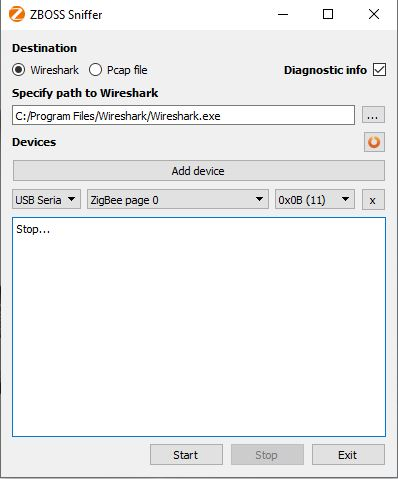
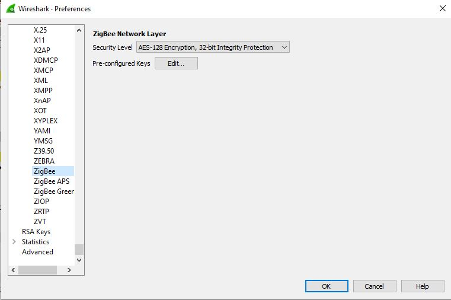
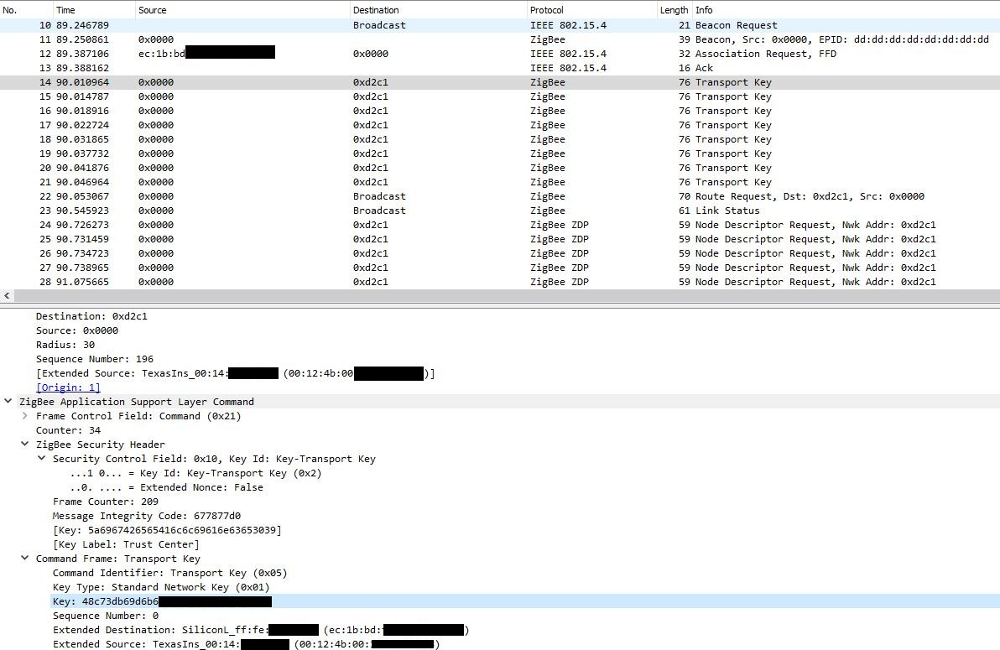
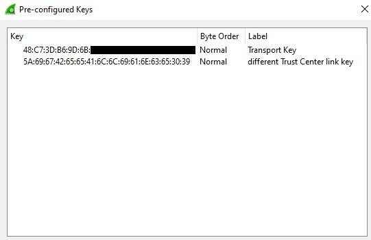
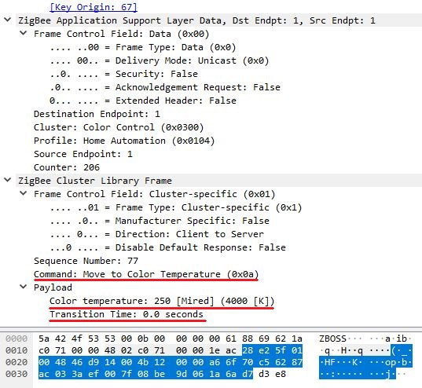

> # Sniffing ZigBee Traffic

Door middel van een tweede CC2531 USB sniffer is het mogelijk om het zigbee netwerk te sniffen. Hiervoor moeten we de CC2531 flashen met geschikte firmware hiervoor. Dit wordt in de detail beschreven op deze [pagina](https://www.zigbee2mqtt.io/how_tos/how_to_sniff_zigbee_traffic.html).

## Wireshark

Als software gebruiken we Wireshark. Dit kan geïnstalleerd worden met onderstaande code.

```{bash}
cd /opt
sudo apt-get install -y libusb-1.0-0-dev wireshark
curl -L https://github.com/homewsn/whsniff/archive/v1.1.tar.gz | tar zx
cd whsniff-1.1
make
sudo make install
```

## ZBOSS 
ZBOSS sniffer is een open-source cross-platform Zigbee pakketsniffer. het bevat een eenvoudig gebruikers-interface en is bedoeld om te werken met Wireshark.
Maake een Account, Log in, en download de Source Code via deze [link](https://zboss.dsr-wireless.com/downloads/index/zboss)



Het default channel voor Zigbee2Mqtt is ```0x0B (11)```. 

Deze sleutel is de gehashed Hex van de ASCII woordje "ZigBeeAlliance09" die nu is publiek beschikbaar voor iedereen. [bron]("https://peeveeone.com/?p=135")
```
TC:   5A:69:67:42:65:65:41:6C:6C:69:61:6E:63:65:30:39
```

Met deze sleutel kunnen wij alle pakketjes met Wireshark decrypteren, nu gaan we deze sleutel toevoegen aan Wireshark. Edit-> preferences-> protocols -> ZigBee 



Wanneer een apparaat probeert deel te nemen aan de ZigBee-setup, dan het nieuwe aangesloten apparaat verzendt een verzoek een geeft basisinformatie over zichself.
De trust center encrypteert de Netwerk-Sleutel met de TC-sleutel die wij al hebben.



Nu gaan we deze sleutel ook aan wireshark toevoegen.



Vervolgens, gaan we alle communicatie kunnen uitlezen en decrypteren, binnen het Zigbee netwerk


