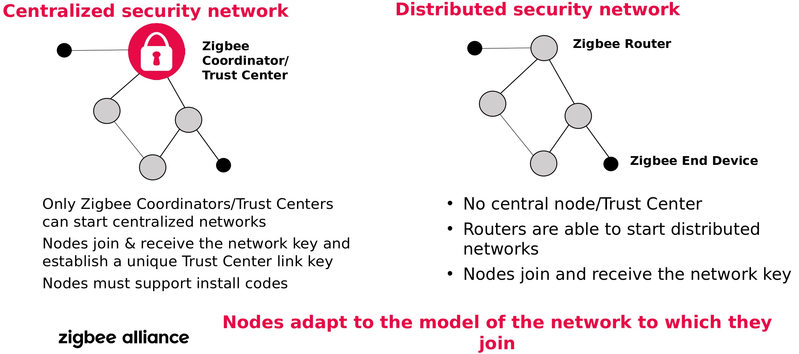

> # Security Architecture


## Security maatregelen

De beveiliging is gebaseerd op symmetrische sleutelcryptografie waarbij twee partijen dezelfde sleutels moeten delen om te communiceren.
ZigBee maakt gebruik van het zeer veilige 128-bit AES encryptiesysteem. 

De security architectuur in Zigbee is gebasserd op "Open Trust" model, maar deze beveiligingsfuncties zijn echter gebaseerd op bepaalde aannames:
source:  Inc. Zigbee Alliance,Zigbee 3.0 Stack User GuideJN-UG-3113(October 5, 2016).

#### Security veronderstellingen

* De protocol-stack lagen vertrouwen elkaar en de laag die een frame voortbrengt verantwoordelijk is voor het beveiligen daarvan.
* De beveiligingservices beschermt de interfaces tussen verschillende toestellen via encryptie.
* Interfaces tussen verschillende lagen op hetzelfde appaat zijn niet geëncrypteerd, hierdoor worden sleutels hergebruikt.
*  De Secret keys worden niet per ongeluk onthuld tijdens sleuteltransport transactie. (Een uitzondering hierop is tijdens de per-configuratie van een nieuw apparaat, waarbij een __onbeschermd__ __sleutel__ kan worden verzonden).
* Beschikbaarheid van bijna perfecte random number generator.
* Beschikbaarheid van fraudebestendige hardware.

ZigBee onderstennt ook Frequency Agility (frequency jumping), waarbij het netwerk wordt verplaatst in geval van een storing of jamming attack.

source: zigbee 3.0 Task Force,zigbee: Securing the Wireless IoT(2017)


## Security Model

Om te voldoen aan een breed scala aan toepassingen met behoud van lage kosten en stroom, biedt ZigBee twee netwerkmodellen aan, namelijk gedistribueerd en gecentraliseerd. Ze verschillen in hoe ze nieuwe apparaten in het netwerk toelaten en hoe ze berichten op het netwerk beschermen.

#### Gedistribueerd beveiligingsmodel

Het biedt een minder beveiligd en eenvoudiger systeem. het heeft twee apparaattypen: routers en eindapparaten.
Een router kan een gedistribueerd beveiligingsnetwerk vormen als hij geen bestaand netwerk kan vinden.
Elke router kan __netwerksleutels__ uitgeven.
Wanneer een nieuwe router of een apparaat zich bij het netwerk aansluit, verzenden de eerdere routers op het netwerk de sleutel.
Om een deel te nemen aan gedistribueerde beveiligingsnetwerk, moeten alle routers en eindapparaten vooraf geconfigureerd zijn met een __koppelingssleutel__ die wordt gebruikt om de __netwerksleutel__ te encrypteren bij het doorgeven ervan aan een nieuwe lid.

#### Gecentraliseerd beveiligingsmodel

Deze beveiligingsmodel beidt een hogere beveiligingnveau. Het is ook ingewikkeld omdat het een derde apparaattype bevat, die een Trust Center (TC) genoemd, en dat is meestal de netwerkcoordinator.

Trust Center (TC) vormt een gecentraliseerd netwerk, configureert en verifieert routers en apparaten, en het maakt een unieke __koppelingsleutel__ voor elke nieuwe apparaat op het netwerk wanneer ze zich aanmelden.
TC bepaalt ook de __netwerksleutel__. 
Om een deel te nemen aan een zo'n model, moeten alle entiteten geconfigureerd te zijn met een vooraf __koppelingsleutel__.

<br>



<br>


>## Security Keys

Er zijn drie typen sleutels beschikbaar binnen de ZigBee technologie:

##### Master Key
Beschouwd als de belangrijkste sleutels onder communiceerde nodes. Deze sleutel wordt gebruikt in de Key Establishment Procedure genaamd SKKE (afk: Symmetrics Key Key Exchange) om de uitwisseling van __koppelingssleutels__ tussen twee nodes vertrouwelijk te houden.
Tijdens de fabricage van een apparaat er wordt een __Master__ __sleutel__ erbinnen geinstalleerd, __**of**__ er kunnen draadloos worden geinstalleerd in het ZigBee netwerk. Deze worden meestal gedeeld door alle nodes.
Nieuwe nodes gebruiken ook de __Master__ __key__ via het SKKE-protocol om de __koppelingssleutels__ met de andere nodes in te stellen. 

##### Link Key
Deze sleutel wordt gebruikt om alle informatie te encrypteren die tussen twee nodes wordt uitgewisseld. Ze worden beheerd op applicatieniveau en zijn uniek voor elk paar nodes.

##### Network Key
Deze sleutel wordt oorspronkelijk gegenereerd door het Trust Center, om te bescheremen tegen aanvallen van buitenaf. Het kan ook met verschillende intervallen opnieuw worden gegenereerd en zijn nodig om de nodes op het netwerk te laten aansluiten. Het is een 128b-sleutel, en wordt gedeeld door alle apparaten in het netwerk.


> # Security issues


## Issue 1: 
De standaard Trust Center sleutel is openbaar! [bron](https://peeveeone.com/?p=135)
Meerdere security-onderzoekers hebben al geraporteerd dat de TC-sleutel niet wordt geupdate of veranderd.

```
The Default Trust Center Link Key is public: ZigBeeAlliance09 
    5A 69 67 42 65 65 41 6C 6C 69 61 6E 63 65 30 39
```
Vroeger werd de TC-sleutel openbaar overgedragen, nu is wel gencrypteerd maar met een default TC. 

## Issue 2: 
Er is bijna geen echte implementatie van Link-Sleutels, dit wil zeggen als iemand een van de sleutel heeft, het het volledig network kan controleren.
Deze sleutel kan getrokken worden uit het toestel zelf, of tijdens de key-exchange.

## Issue 3:
Geen Key-Rotation.
Er zijn geen configuratie mogelijkhedien voor Zigbee Security, m.a.w. we kunnen de Network-Sleutel niet veranderen, of een nieuwe sleutel aan te vragen. Als een toestel wordt gecompromitteerd, moeten wij de volledig systeem weg gooien, en nieuw systeem kopen.

## Issue 4:
Het is bijna onmogelijk om de sleutel te verwijderen op een bepaald toestel, omdat meest van de toestellen geen reset machanisme hebben, en de enige manier is het toestel te vernietigen, om zeker te zijn dat niemand aan uw sleutel kan.

Bv. Smart Hub, Philips Hue continue zoeken voor een netwerk om erbij aan te sluiten.


