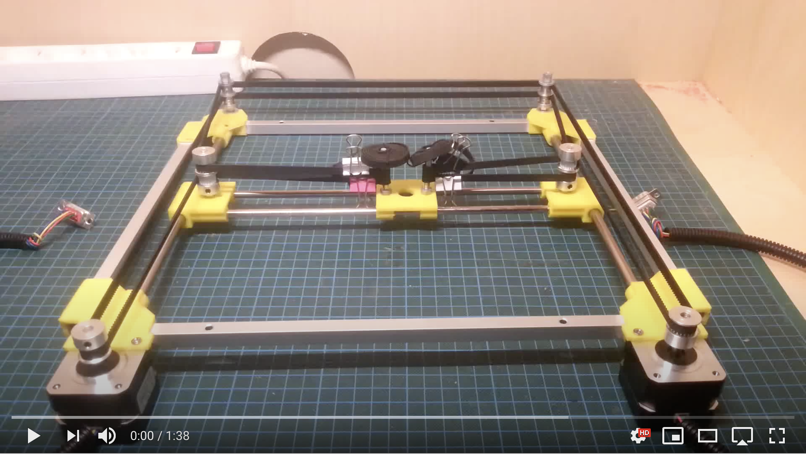

# Bill of materials (v0.1)

Versie 0.1 van het xy-systeem wordt mechanisch gebaseerd op volgende (bewezen) prototype. Afmetingen worden beperkt op 500mm x 500mm gebruik makend van de reeds voorhanden zijnde profielen.

## Mechanische onderdelen

| Beschrijving                                                 | Hoeveelheid | Prijs     | Totaal                                                       |
| ------------------------------------------------------------ | ----------- | --------- | ------------------------------------------------------------ |
| [Aluminium profiel 1515 lengte 1 m (123-3D huismerk)](https://www.123-3d.nl/123-3D-Aluminium-profiel-1515-lengte-1-m-123-3D-huismerk-i1470-t14579.html) | 2           | €9.50     | €19.00                                                       |
| [Staaf voor X- of Y-as glad 10 mm x 100 cm](https://www.123-3d.nl/123-3D-Staaf-voor-X-of-Y-as-glad-10-mm-x-100-cm-i58-t13816.html) | 2           | €4.75     | €9.00                                                        |
| [LM10UU Lineaire kogellager](https://www.123-3d.nl/123-3D-LM10UU-Lineaire-kogellager-i24-t13816.html) | 8           | €2.00     | €16.00                                                       |
| [GT2 timing belt 6 mm (per meter)](https://www.123-3d.nl/123-3D-GT2-timing-belt-6-mm-per-meter-i40-t15039.html) | 4           | €4.50     | €18.00                                                      |
| [GT2 Pulley hoge resolutie - 6 mm riem - 20 tanden - 5 mm as](https://www.123-3d.nl/123-3D-GT2-Pulley-hoge-resolutie-6-mm-riem-20-tanden-5-mm-as-i2081-t14815.html) |2|€6.00|€12.00|
| [GT2 Pulley met lager hoge resolutie - 6 mm riem - 20 tanden - 3 mm as](https://www.123-3d.nl/123-3D-GT2-Pulley-met-lager-hoge-resolutie-6-mm-riem-20-tanden-3-mm-as-i2083-t14823.html) | 8 | €5.50 | €44.00 |

## Elektronica

| Beschrijving             | Hoeveelheid | Prijs   | Totaal  |
| ------------------------ | ----------- | ------- | ------- |
| [Stepstick DRV8825](https://www.123-3d.nl/123-3D-Stepstick-DRV8825-stappenmotordriver-i96-t332.html)        | 2           | 5.75 €  | 11.5 €  |
| [ESP-Cam +  FTDI](https://www.amazon.de/KeeYees-Bluetooth-ESP32-CAM-Entwicklungsboard-Kameramodul/dp/B07S83X9NM/ref=sr_1_5?__mk_de_DE=%C3%85M%C3%85%C5%BD%C3%95%C3%91&dchild=1&keywords=esp+cam&qid=1602251628&sr=8-5)          | 1           | 16.99 € | 16.99 € |
| [Nema17motor](https://www.123-3d.nl/123-3D-NEMA17-stappenmotor-0-9-graden-per-stap-48-mm-lang-4-2-kg-cm-SL42S248MA108-0524-i3420-t14804.html) | 2           | 14.50 € | 29.00 € |
| [Mechanische eindstop](https://www.123-3d.nl/123-3D-Microswitch-eindstop-i974-t324.html)     | 4           | 2.25 € | 9.00 € |
| [LM7805](https://be.farnell.com/stmicroelectronics/l7805abv/ic-v-reg-5v/dp/1467758)     | 1           | 0.50 € | 0.50 € |

